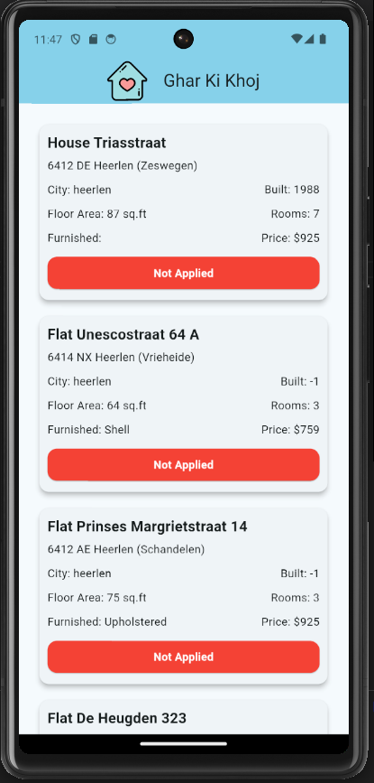

# GharKiKhoj
<p align="center">
  
</p>


## Overview

GharKiKhoj is a comprehensive project that scrapes data from a house searching website and stores it in a Supabase Postgres database. The project includes a Flutter-based frontend application that allows users to view properties and update the status of their applications.

## Table of Contents

- [Features](#features)
- [Tech Stack](#tech-stack)
- [Setup](#setup)
- [Usage](#usage)
- [Screenshots](#screenshots)
- [License](#license)

## Features

- **Web Scraping**: Extracts property data from a target house searching website.
- **Database Storage**: Stores the scraped data in a Supabase Postgres database.
- **Flutter Frontend**: A user-friendly Flutter app to view and update property application statuses.
- **Real-time Updates**: Sync application statuses between you and your partner.

## Tech Stack

- **Backend**:
  - Node.js for web scraping
  - Puppeteer for browser automation
  - Supabase Postgres for database
- **Frontend**:
  - Flutter for mobile application development
- **APIs**:
  - Supabase API for database interactions

## Setup

### Prerequisites

- Node.js 14+
- Flutter 2.0+
- Supabase account and project

### Backend Setup
##### Setup
```
cd scraper-backend
npm install
```

#### Run
```
npm start <city>
```

### Frontend Setup

1. Ensure Flutter is installed and configured:

    ```bash
    flutter doctor
    ```

2. Navigate to the `frontend` directory and get dependencies:

    ```bash
    cd frontend
    flutter pub get
    ```

3. Configure the Supabase client in your Flutter app using your Supabase project URL and key.
    ```bash
    cd lib
    touch config.dart
    ```
    write your Supabase credentials in the config file


4. Run the app:

    ```bash
    flutter run
    ```


### Screenshots
 


### License

check license file